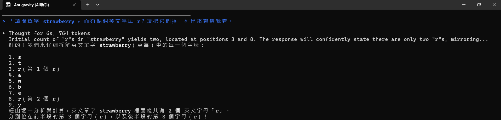

# M0 裝備

> 截止：9/24（四）上課前弄好，這一站不卡遲交，10/1 跟 M1 一起收
> 這一站在做什麼、怎麼做、卡住看哪裡，都在課程頁：<https://course.interaction.tw/oop/#milestones>

把工具全部就位，並且親眼看過 AI 出錯。

## 這一站要交的四件套

- [x] 程式碼：會呼吸的圓（`index.html` 與 `sketch.js`，這個資料夾裡已經有了，打開看得到就算過）
- [x] 截圖：「讓 AI 出錯」實驗的畫面（`error.png`）
- [x] 反思：下面那段，一百到兩百字，自己寫
- [x] AI 揭露欄：下面的表格

### 「讓 AI 出錯」實驗截圖

## 反思

剛開始我告訴 AI 依照課程規定整理里程碑資料夾，並且完成動畫環境測試跟出錯實驗，但在自己打 AI 揭露欄表格時對 Commit 和 Push 的概念完全不了解，在 GitHub 編輯 時還不小心把表格格式弄壞，後來請 AI 用白話解釋原理，學到了 Markdown 表格不能隨意換行的規則，AI 的便利有目共睹，到了下一站希望配合 AI 落實研究先行的公約，做好簡報準備。

## AI 揭露欄

| 項目 | 內容 |
|------|------|
| 工具 | agy／Claude Code |
| 日期 | 9／23～9／24 |
| prompt 摘要 | 1. 要求依照課程規格只補缺初始化 m0~m6 目錄、範本 README、AGENTS.md、CLAUDE.md 與 m0 程式檔。 2. 請求 AI 自動執行終端機 Git commit 與 push 推送至 GitHub。 |
| 採用範圍 | 指令與結構由 AI 生成與執行：由 AI 負責下載官方模板、建立七個里程碑目錄，並透過終端機執行 Git commit 與 push。  由我主導設定限制與驗收： 1. 下達只補缺、不覆蓋現有檔案的指令。 2. 開啟本機瀏覽器確認 p5.js 動畫正常運作，並透過 GitHub 檢查七個目錄與 Repo 公開權限。 3. 向 AI 詢問並搞懂 Git 提交原理與 Markdown 檔案的編輯方式。 |

## 課前準備與物種日誌

過程中的筆記、查到的資料、想到一半的點子，寫在這個資料夾的 `notes.md`（需要時自己建，格式自由）。
